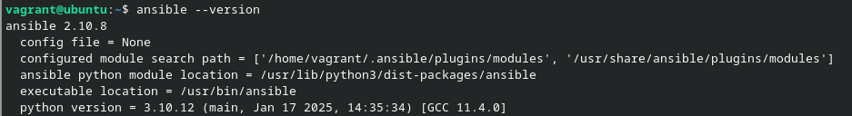
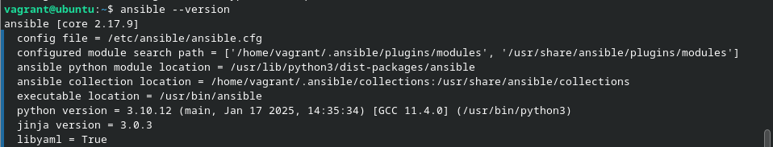
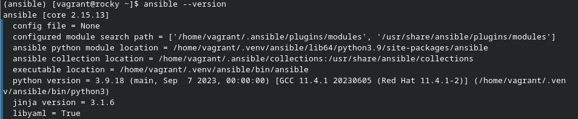

# Ansible par la pratique (3) – Installation

## Exercice 1

Commande pour la realisation de l'exercice.

```bash
vagrant up ubuntu
vagrant ssh ubuntu
sudo apt update
apt-cache search --names-only ansible
sudo apt install -y ansible
```

Resultat :



## Exercice 2

Commande pour la realisation de l'exercice.

```bash
vagrant up ubuntu
vagrant ssh ubuntu
sudo apt-add-repository ppa:ansible/ansible
apt-cache search --names-only ansible
sudo apt install -y ansible
```

Resultat :



La version PPA est bien plus recente que celle presente sur les dépôts oficiel.

## Exrecice 3

Commande pour la realisation de l'exercice.

```bash
vagrant up rocky
vagrant ssh rocky
python3 -m venv ~/.venv/ansible
source ~/.venv/ansible/bin/activate
pip install --upgrade pip
pip install ansible
```

Resultat :


