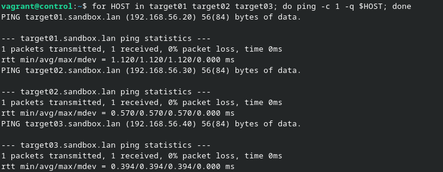

# Ansible par la pratique (4) – Authentification

## Exercice 1


Ajout dans /etc/hosts :

```bash
192.168.56.20 target01.sandbox.lan target01
192.168.56.30 target02.sandbox.lan target02
192.168.56.40 target03.sandbox.lan target03 
```

Test de la configuration :

```bash
for HOST in target01 target02 target03; do ping -c 1 -q $HOST; done
```



Récupération des clés publiques :

```bash
ssh-keyscan -t rsa target01 target02 target03 >> .ssh/known_hosts
```


> J'active l'authentification par mot de passe.

```bash
ssh-copy-id vagrant@target01
ssh-copy-id vagrant@target02
ssh-copy-id vagrant@target03
```


Ping ansible des trois neuds :

```bash
ansible all -i target01,target02,target03 -m ping
```


