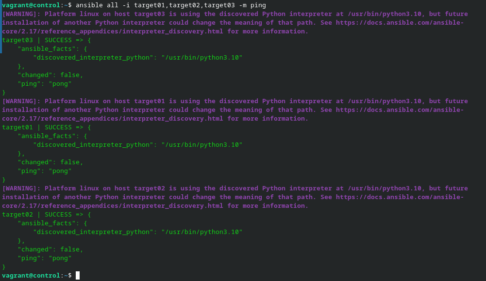
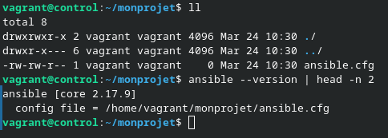
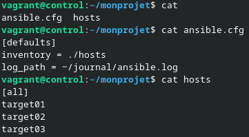
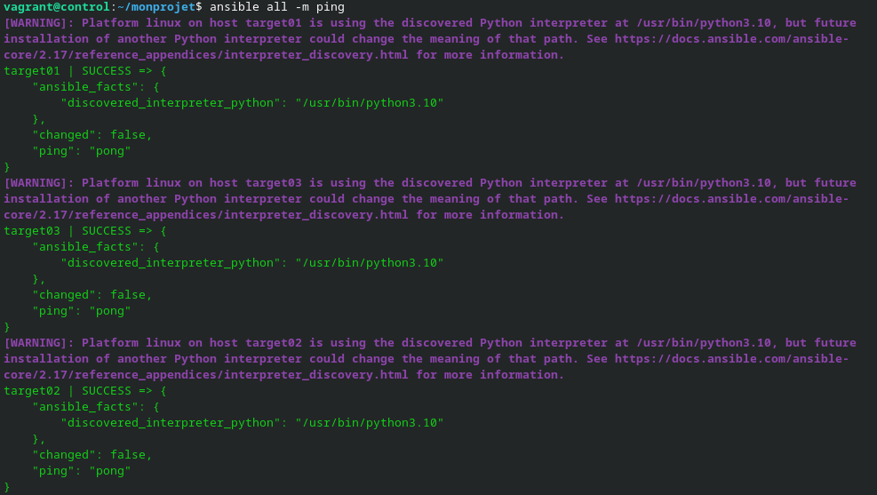
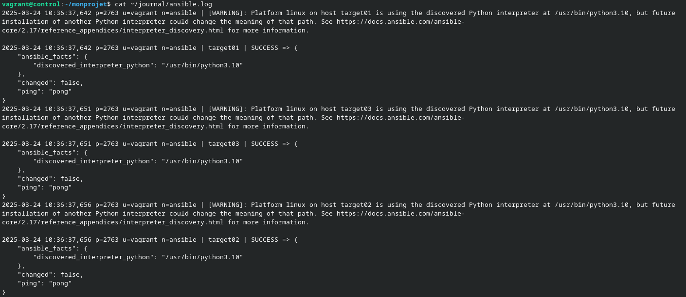
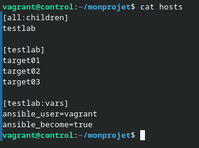
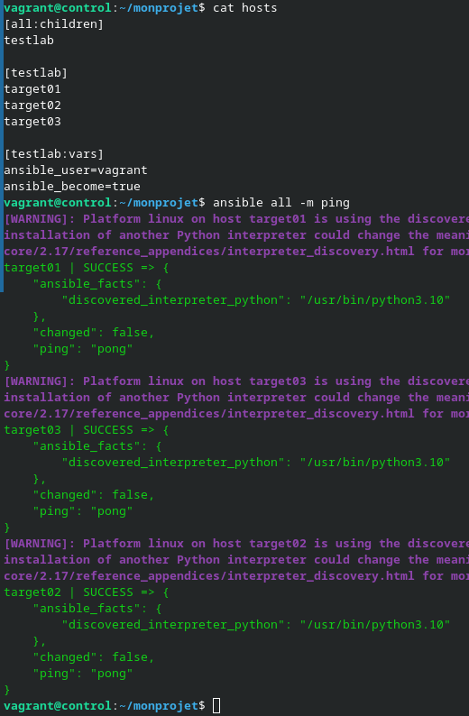
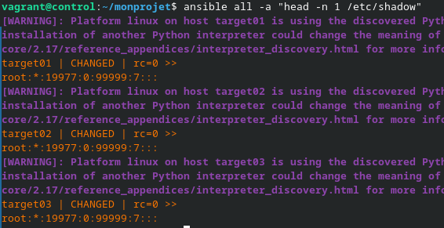

# Ansible par la pratique (6) – Configuration de base

Ajout dans /etc/hosts :

```bash
192.168.56.20 target01.sandbox.lan target01
192.168.56.30 target02.sandbox.lan target02
192.168.56.40 target03.sandbox.lan target03 
```

> Comme dans 04-Authentification je configure l'authentification SSH

J'installe ansibe avec :

```bash
sudo apt-add-repository ppa:ansible/ansible
sudo apt install -y ansible
```

Je fait le ping avec ansible :

```bash
ansible all -i target01,target02,target03 -m ping
```



Je crée le fichier de configuration dans le répertoire monprojet :



Je configure mon inventaire et le path de mes logs :



Je test ma configuration :



Les logs sont bien mis dans ~/journal :



Je modifie mon inventaire :



Le ping fonctionne toujours :



Je peux aussi, avec cette configuration afficher le /etc/shadow


