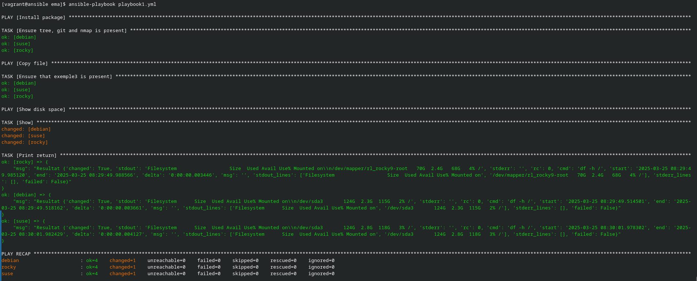
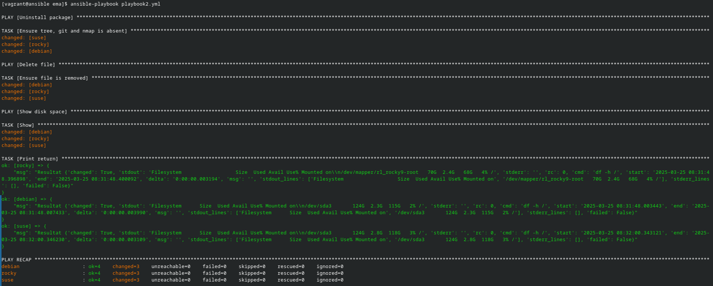
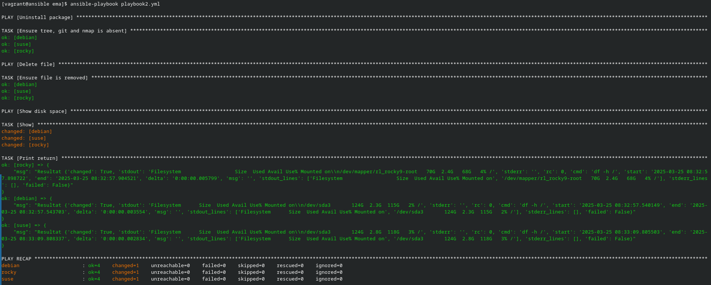
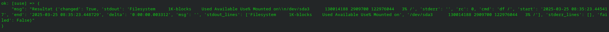
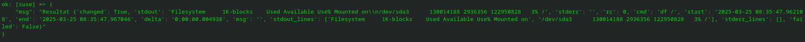

# Ansible par la pratique (8) – Idempotence

## Exercice

Pour la realisation de l'exercice, je realise deux playbooks, composé de plusieurs plays. Le premier realise les tache d'instalation et de copy de fichier. Le second désinstalle les packet et suprime les fichier.

### Playbook 1

```yaml
- name : Install package
  hosts: all
  gather_facts: false
  tasks:
    - name: Ensure tree, git and nmap is present
      ansible.builtin.package:
        name:
          - tree
          - git
          - nmap
        state: present
- name: Copy file
  hosts: all
  gather_facts: false
  tasks:
    - name: Ensure that exemple3 is present
      ansible.builtin.copy:
        src: /etc/fstab
        dest: /tmp/test3.txt
- name: Show disk space
  hosts: all
  gather_facts: false
  tasks:
    - name: Show 
      ansible.builtin.shell: df -h /
      register: result
    - name: Print return
      ansible.builtin.debug:
        msg: "Resultat {{result}}"
```

Voici l'ouput après quelques runs :



### Playbook 2

```yaml
- name : Uninstall package
  hosts: all
  gather_facts: false
  tasks:
    - name: Ensure tree, git and nmap is absent
      ansible.builtin.package:
        name:
          - tree
          - git
          - nmap
        state: absent
- name: Delete file
  hosts: all
  gather_facts: false
  tasks:
    - name: Ensure file is removed
      ansible.builtin.file:
        path: /tmp/test3.txt
        state: absent
- name: Show disk space
  hosts: all
  gather_facts: false
  tasks:
    - name: Show 
      ansible.builtin.shell: df -h /
      register: result
    - name: Print return
      ansible.builtin.debug:
        msg: "Resultat {{result}}"
```

Voici l'output au premier run :



Apres le premier run on voi bien l'idempotence :



### Compataison





Quand on compare les espaces disque, on remarque que le disque est plus vide après les désinstallations et suppression.