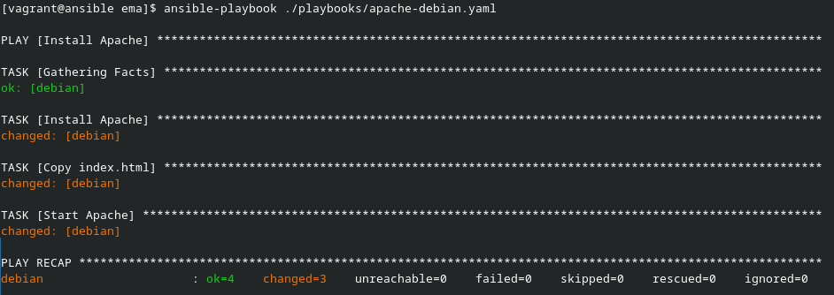
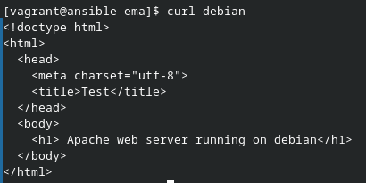
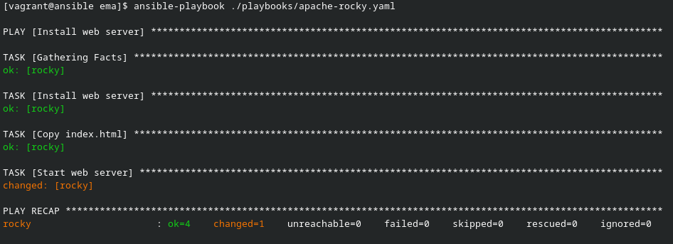
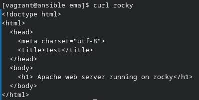
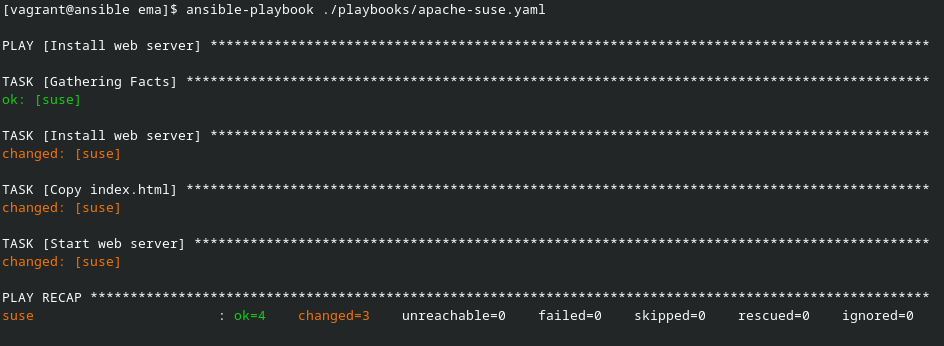
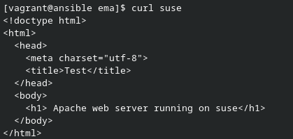

# Ansible par la pratique (10) – Un serveur web simple

## apache-debian.yaml

[Ici se trouve le playbook apache-debian.yaml](apache-debian.yaml)

Voici le premier run du playbook :

Voici le resultat :

## apache-rocky.yaml

[Ici se trouve le playbook apache-rocky.yaml](apache-rocky.yaml)

Voici le premier run du playbook :

Voici le resultat :

## apache-suse.yaml

[Ici se trouve le playbook apache-suse.yaml](apache-suse.yaml)

Voici le premier run du playbook :

Voici le resultat :

