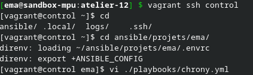
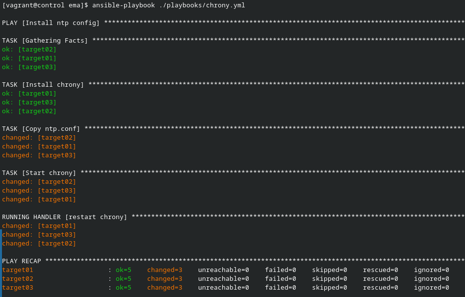
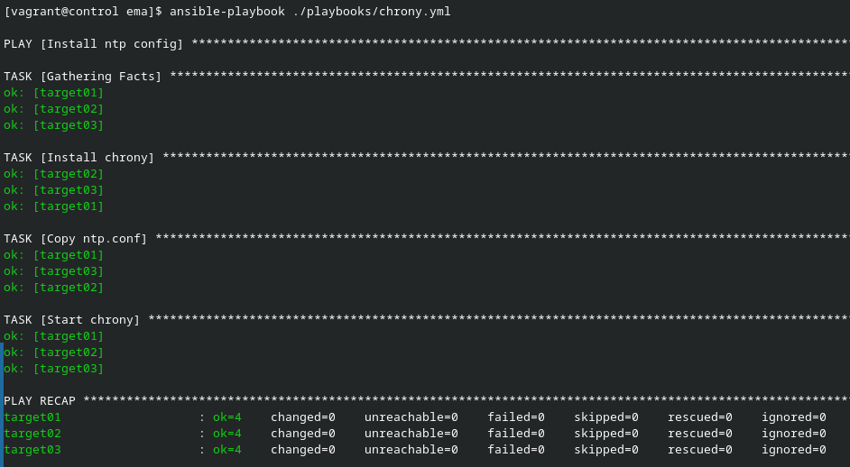

# Ansible par la pratique (11) – Handler

## Exercice

Création du playbook :

[Ici se trouve le playbook chrony.yml](playbook.yml)

Première exécution :

Lors de la première exécution chrony est installer, configurer et restarted.

Réexécution du playbook :

Quand le playbook est réexécution, vu que chrony n'est pas reconfiguré, il n'est pas redémarré.
