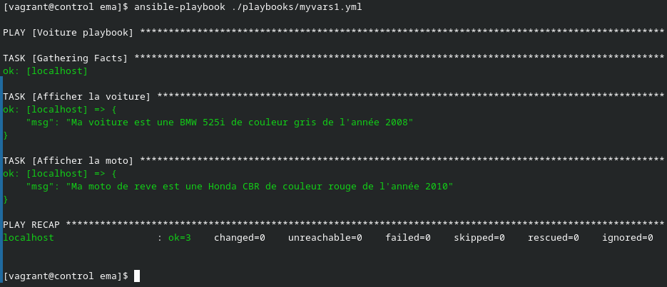
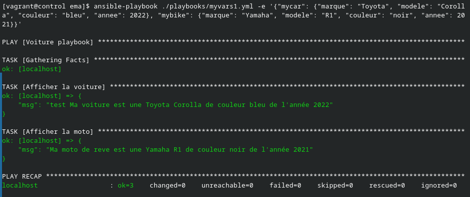
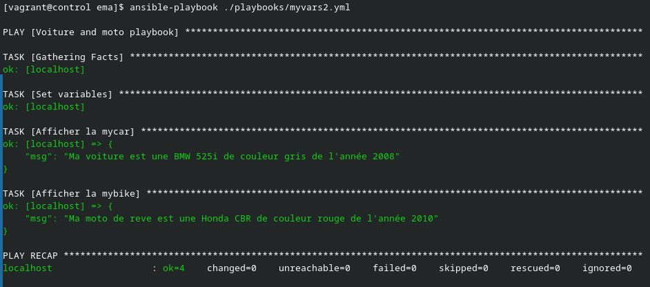
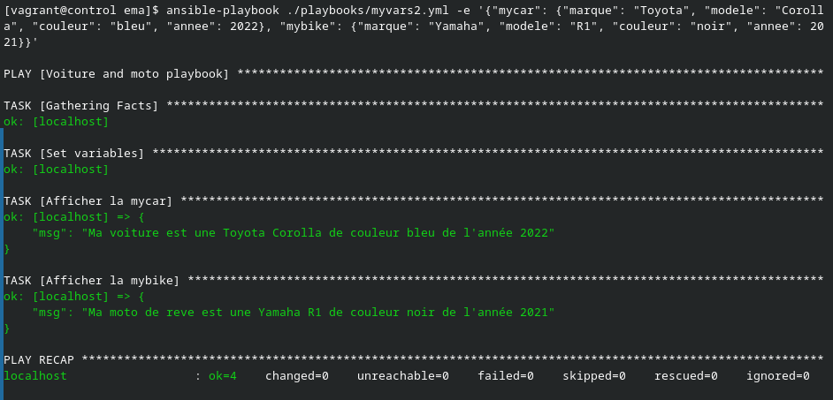
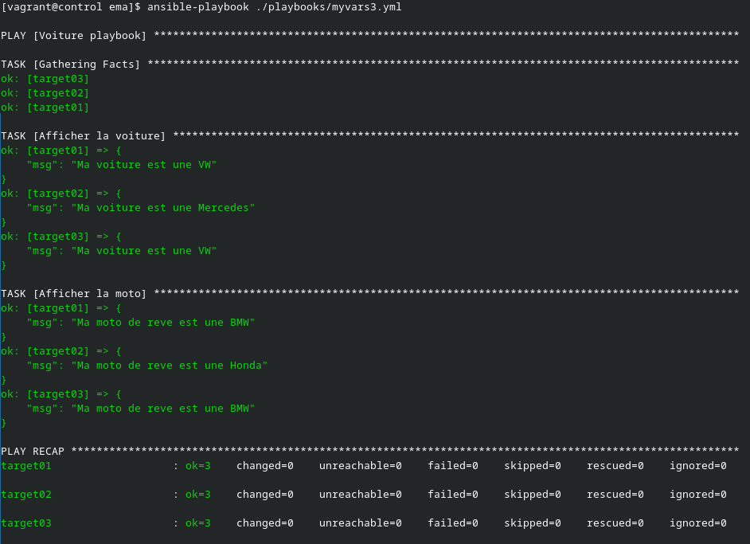
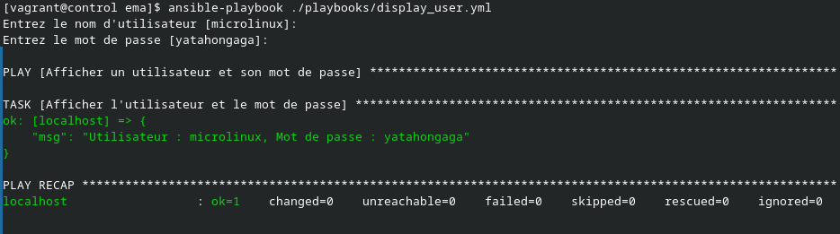
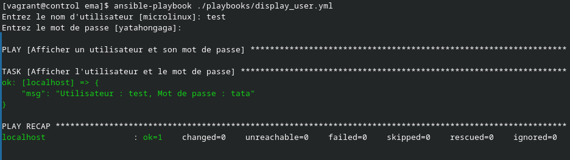

# Ansible par la pratique (12) – Variables

## Exercice

> Écriture d'un playbook qui affiche ma voiture et ma moto.

### myvars1

[Ici se trouve le playbook myvars1.yml](myvars1.yml)

Voici le retour d'exécution du playbook :



Quand j'utilise des extravarse pour surpasser les vars du play, voici ce que cela donne :

Commande utilisé :

```bash
ansible-playbook ./playbooks/myvars1.yml -e '{"mycar": {"marque": "Toyota", "modele": "Corolla", "couleur": "bleu", "annee": 2022}, "mybike": {"marque": "Yamaha", "modele": "R1", "couleur": "noir", "annee": 2021}}'
```

Retour de la commande :



### myvars2

[Ici se trouve le playbook myvars2.yml](myvars2.yml)

Voici le retour de ce second playbook qui utilise une task set_fact :



Comme précédemment voici le retour de ce playbook avec les vars passé en extravars.

Commande utilisé :

```bash
ansible-playbook ./playbooks/myvars1.yml -e '{"mycar": {"marque": "Toyota", "modele": "Corolla", "couleur": "bleu", "annee": 2022}, "mybike": {"marque": "Yamaha", "modele": "R1", "couleur": "noir", "annee": 2021}}'
```



### myvars3

> Ici, on utilise les vars défini dans l'inventaire.

Voici mon inventaire :

```ini
[testing]
target01
target02 mycar=Mercedes mybike=Honda
target03

[testing:vars]
ansible_python_interpreter=/usr/bin/python3
ansible_user=vagrant
ansible_become=yes
mycar=VW
mybike=BMW
```

[Ici se trouve le playbook myvars3.yml](myvars3.yml)

J'ai défini des variables par défaut pour touts les hosts de l'inventaire, mais aussi des vars spécialement pour la target02.

Voici l'output du playbook :



### display_user

> Ici on test les vars qui sont input pendant l'exécution du playbook

[Ici se trouve le playbook display_user.yml](display_user.yml)

Voici l'output par defaut du playbook :



Voici l'output quand on entre les valeurs manuellement :


