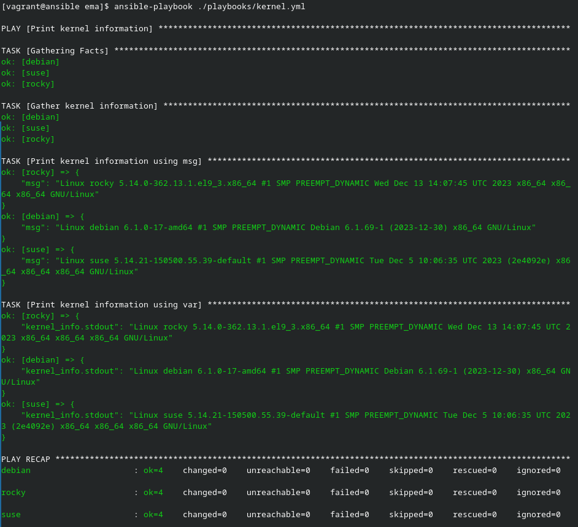
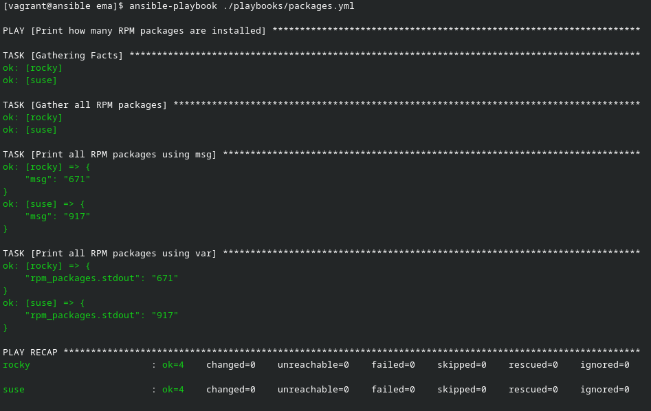

# Ansible par la pratique (13) – Variables enregistrées

## Exercice

### kernel.yml

Voici le playbook :

```yml
---

- name: Print kernel information
  hosts: all
  tasks:
    - name: Gather kernel information
      ansible.builtin.command:
        cmd: uname -a
      register: kernel_info
      changed_when: false
    - name: Print kernel information using msg
      ansible.builtin.debug:
        msg: "{{ kernel_info.stdout }}"
    - name: Print kernel information using var
      ansible.builtin.debug:
        var: kernel_info.stdout

```

Ce playbook affiche les infos du kernel des deux façons. En utilisant msg et var. Voici l'output du playbook :




### packages.yml

Voici le playbook :

```yml
---

- name: Print how many RPM packages are installed
  hosts:
    - rocky
    - suse
  tasks:
    - name: Gather all RPM packages
      ansible.builtin.shell: rpm -qa | wc -l
      register: rpm_packages
      changed_when: false
    - name: Print all RPM packages using msg
      ansible.builtin.debug:
        msg: "{{ rpm_packages.stdout }}"
    - name: Print all RPM packages using var
      ansible.builtin.debug:
        var: rpm_packages.stdout

```

Ce playbook compte le nombre de paquets installé sur l'host. Voici l'output du playbook :


