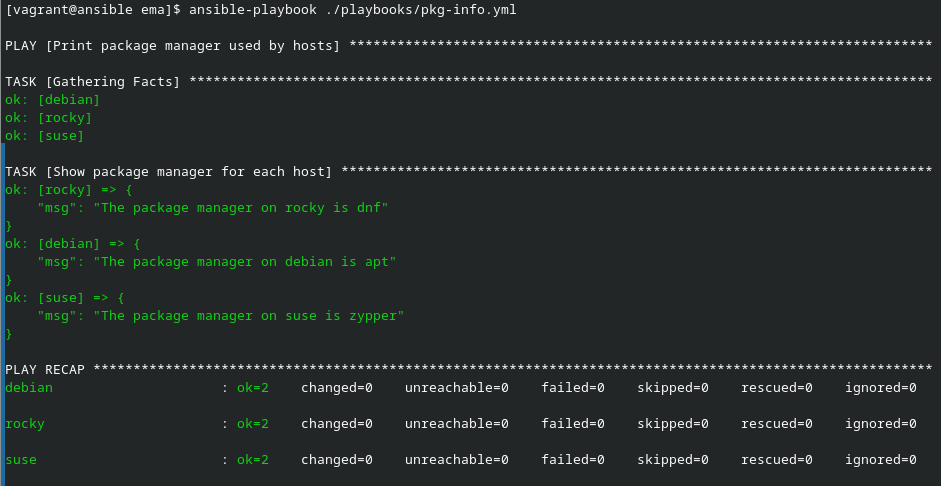
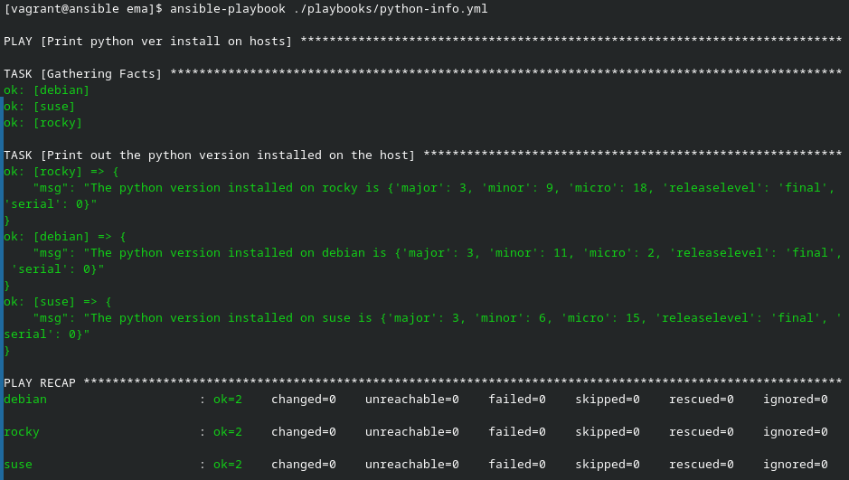
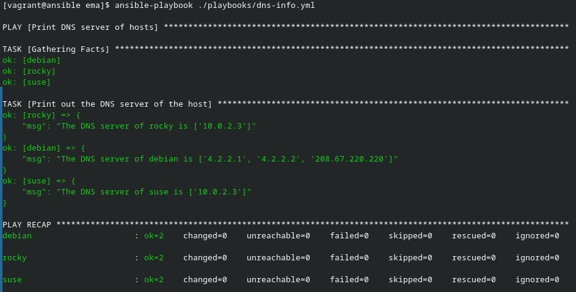

# Ansible par la pratique (14) – Facts et variables implicites

## Exercice

### pkg-info

L'objectif du playbook est d'afficher le gestionnaire de paquets de l'host.

Voici le playbook :

```yml
---

- name : Print package manager used by hosts
  hosts: all
  gather_facts: true
  tasks:
    - name: Print out the package manager used by the host
      ansible.builtin.debug:
        msg: "The package manager on {{ inventory_hostname }} is {{ ansible_pkg_mgr }}"
```

Voici l'output du playbook :



### python-info

L'objectif du playbook est d'afficher la version de Python installée de l'host.

Voici le playbook :

```yml
---

- name: Print python ver install on hosts 
  hosts: all
  gather_facts: true
  tasks:
    - name: Print out the python version installed on the host
      ansible.builtin.debug:
        msg: "The python version installed on {{ inventory_hostname }} is {{ ansible_python.version }}"

```

Voici l'output du playbook :



### dns-info

L'objectif du playbook est d'afficher le(s) serveur(s) DNS utilisé(s) de l'host.

Voici le playbook :

```yml
---

- name: Print DNS server of hosts 
  hosts: all
  gather_facts: true
  tasks:
    - name: Print out the DNS server of the host
      ansible.builtin.debug:
        msg: "The DNS server of {{ inventory_hostname }} is {{ ansible_dns.nameservers }}"

```

Voici l'output du playbook :


