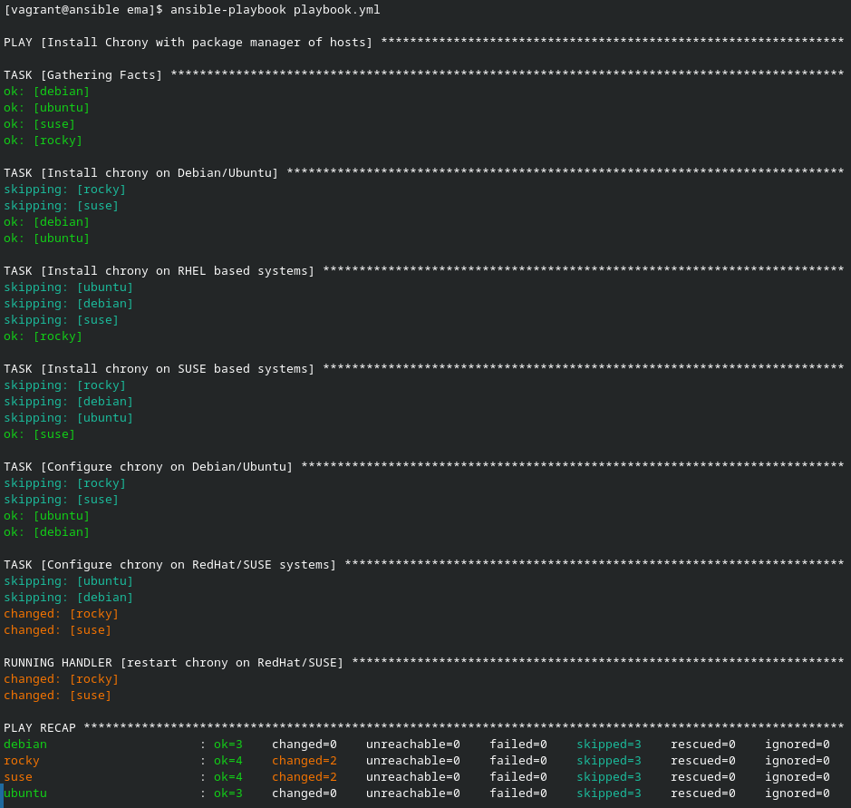
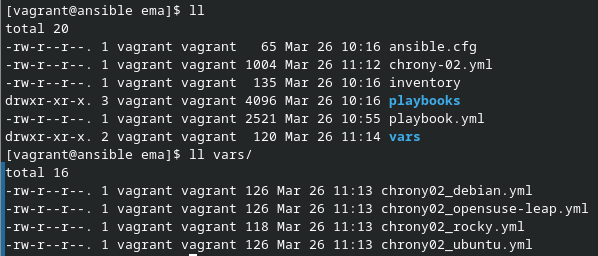
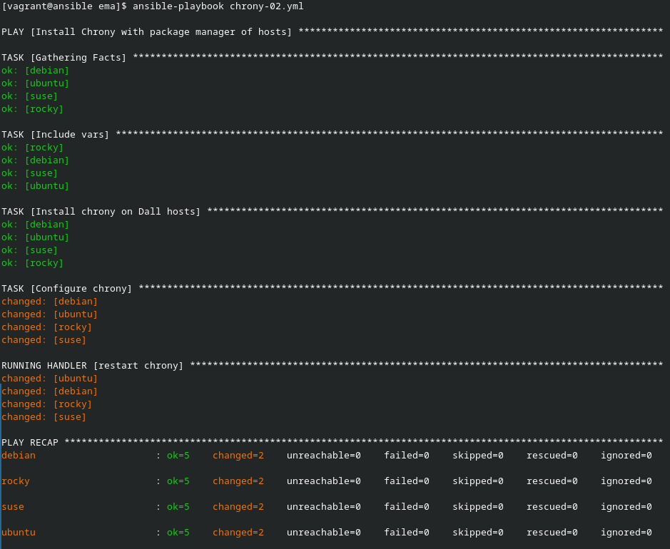
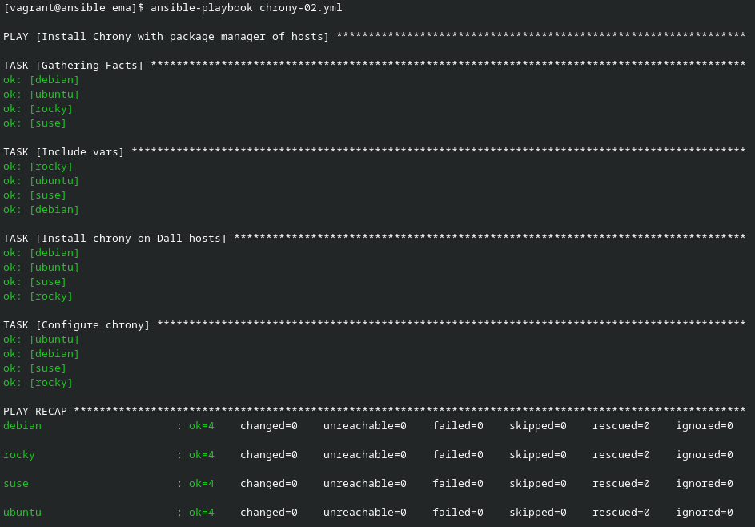

# Ansible par la pratique (15) – Cibles hétérogènes

## Exercice

### chrony-01

[Ici se trouve le playbook chrony-01.yml](chrony-01.yml)

Ce playbook install chrony avec le gestionaire de packet de l'OS host. Il configure le service selon si c'est un Debian/Ubuntu ou un redhat/openSuse.

Il redemare le service uniquement si la configuration a etait changer.

Voici un run de se playbook ou uniquement les configurations Rocky et Suse sont changer :

### chrony-02

[Ici se trouve le playbook chrony-02.yml](chrony-02.yml)

Les vars sont disponibles dans le dossier ./vars

Pour test sur les même hosts j'ai modifier la configuration de chrony. Voici l'ouput :

Le playbook fonctionne toujours bien et, il est plus simple que le premier.

Apres un nouveau run, comme le precedant, le playbook ne re-effectue pas de restart non essentiel :

