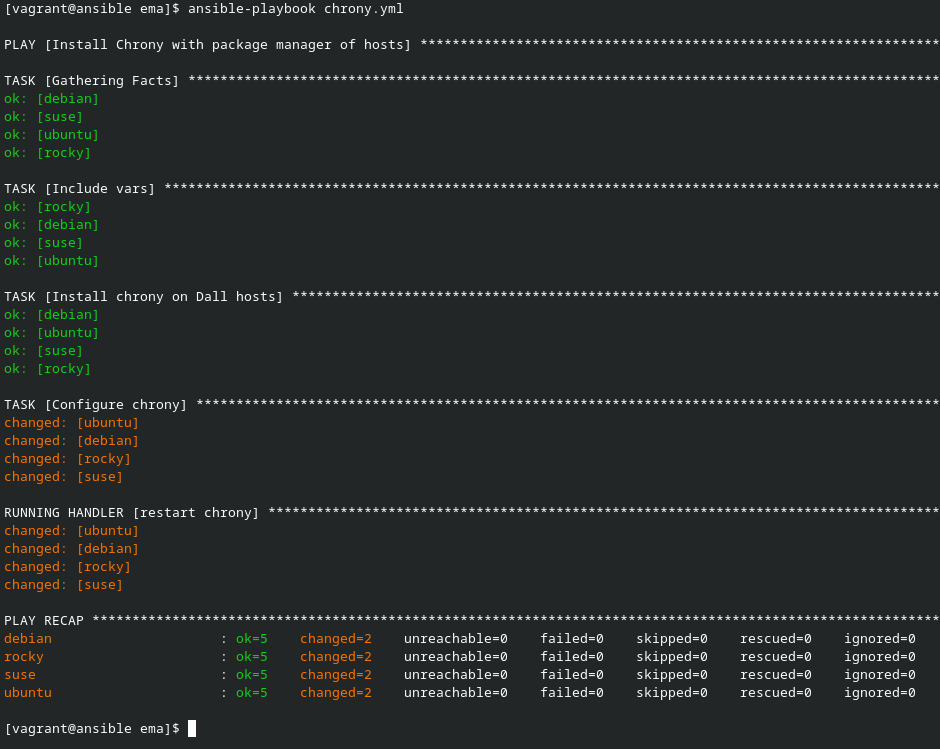
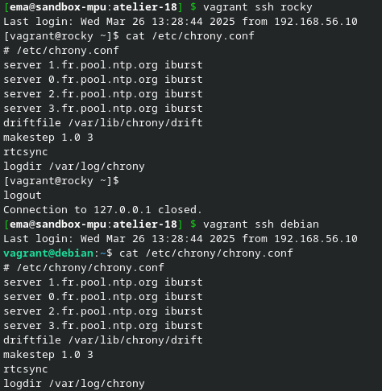

# Ansible par la pratique (16) – Jinja & Templates

## Exercice

> Ce playbook utilise une template Jinja2 pour personnalité la configuration selon la machine.

Pour cela, je réutilise le playbook précédemment crée pour utiliser ma template `chrony.conf.j2`.

Voici la template utilisée :

```jinja2
{# templates/chrony.conf.j2 #}
# {{ chrony_confdir }}
server 1.fr.pool.ntp.org iburst
server 0.fr.pool.ntp.org iburst
server 2.fr.pool.ntp.org iburst
server 3.fr.pool.ntp.org iburst
driftfile /var/lib/chrony/drift
makestep 1.0 3
rtcsync
logdir /var/log/chrony
```

Voici l'output du playbook :



Quand je vérifie sur les VMs, les configuration chrony on bien été personnalité selon la machine :


